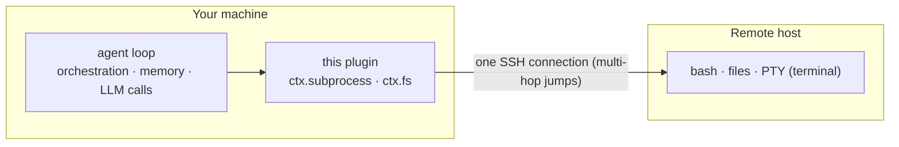

# dsh-workspace-enhancement

English | [中文](README.zh.md)

   

**A DeepSeek Harness workspace-enhancement plugin** — local and remote (SSH) workspaces managed in one place. A session can hold **multiple workspaces** (a main cwd plus side directories), each with its own permissions; machines, TOFU host keys and keychain passwords all live in your local `~/.dsh`. Built on [ssh2](https://github.com/mscdex/ssh2).

## Features

| Feature | Description |
|---|---|
| Remote workspaces | `ctx.subprocess` + `ctx.fs` transparent remote providers: one SSH chain (multi-hop) runs bash / files / PTY / directory browsing with no code changes on the tools |
| Multi-workspace sessions | The「⊕ 工作区」button in the session header: attach one or more **side workspaces** (local dirs or remote machine dirs) to a session, each with its own permission (`fs: read-only / read-write` + `exec: on / off`); the model is told about them and can operate them directly |
| Add-workspace flow | Connection sidebar (saved machines, `~/.ssh/config` aliases, local) + directory browser (breadcrumbs, native chooser, new folder); remote "Connect & open" creates the session straight on the server |
| Machine settings page | Machine CRUD / test / set-current / forget host key; OS-keychain passwords; TOFU host keys (`accept-new` default) |
| Session awareness | Remote marker + online tri-state + reconnect in the sidebar; per-session prompt injection states the remote / side-workspace context and its permission marks |
| Cross-server execution | `sw_exec(server, command)` runs a command on a **named server** (a registry id like `c1`, or the temporary id of `sw_connect save:false`; defaults to the session's machine) — the target OS is probed once per connection and reported (`bash -c` on POSIX, `pwsh -Command` on win32); on Windows hosts a `bash` tool is registered for remote-Linux workspaces |
| Model tools | `sw_status`, `sw_connect` (`save:false` = temporary), `sw_pick_workspace`, `sw_exec` (cross-server execution) |
| Runtime localization | UI copy, the per-session remote-context prompt, `sw_*` tool descriptions/errors AND protocol-data validation/routing errors follow the settings-page **Language** option (`zh`/`en`); the UI defaults to the browser language, so a Chinese browser stays Chinese. Only `bad-request:` protocol-layer diagnostics (machine-readable contract) stay English |

## How it works



No DSH install on the remote: the model orchestrates locally, commands run remotely, results come back into context.

**Design notes** (implementation facts, not user features):

- **Registry & routing**: `remote-workspaces/machines.json` is the single source of truth; `ssh://<id>/<path>` (and the local `dsw-routes` placeholder tree) route every operation to the right machine; `~/.ssh/config` aliases are recognized.
- **Security**: TOFU host keys (`accept-new` / `verify` / `off`), per-machine OS keychain (DPAPI / security / secret-tool), credentials redacted in error messages.
- **Workspace permissions** are enforced at the engine seams (`ctx.subprocess` / `ctx.fs` are this plugin's single implementation): a read-only side workspace rejects writes, `exec: off` rejects launching a process inside that side workspace; command text is not inspected (documented boundary).
- **`sw_exec` semantics**: the command always runs on a **named server** — `server` takes a registry id or the temporary `sw_connect save:false` id and defaults to the session's machine (a local session without a server errors). The target OS is probed once per connection (`uname -s` → `cmd /c ver` → `unknown`) and reported in the first output line; POSIX/unknown runs `bash -c`, win32 runs `pwsh -Command`. The spawn goes through the same mixed provider, so the side-workspace `exec: off` gate and machine routing apply unchanged. `run_in_background` mirrors the official bash tool (job id returned immediately, no timeout; requires `ctx.jobs` and errors honestly when absent); `sandbox_permissions`/escalation is intentionally unsupported (deployment policy only).
- **win32 `bash` seam**: on a Windows host the plugin registers the `bash` tool itself (the official bash executor is not composed there, so the name is free) — a remote-Linux session runs `bash -c` on the server, a local Windows session gets a clear error instead of silently degrading; POSIX hosts never register it (the official `bash` tool owns the name).

## Install

```sh
# from npm (v0.1.0+)
dsh plugin --profile web add dsh-workspace-enhancement
# from source: npm run build first (host loads lib/)
dsh plugin --profile web add <this-repo-path>
```

> **First install with DSH's supply-chain pnpm**: native build scripts are blocked by default —
> allow them once per profile in `pnpm-workspace.yaml` (unstrict `allowBuilds`):
> `ssh2`, `cpu-features`, `koffi`, `node-pty`, `dsh-subprocess-local` — then run
> `dsh plugin --profile web install`. Without it the first `add` exits non-zero
> (`ERR_PNPM_IGNORED_BUILDS`) and the bundle is not appended.

## Compatibility

Which plugin version to install depends on the **DSH host family** you run — check it with `dsh --version`
(and the family under your DSH install, e.g. `<npm root -g>/@deepseek-ai/`):

| Your DSH host | Install | Notes |
|---|---|---|
| **`0.1.5` line** (`0.1.5-rc.1`, `0.1.5-rc.2`, …) | **0.1.4 or newer** | The **only** supported family (peers are `^0.1.5-rc.1`). The browser channel rides the official shared `/api` transport (`/api/dsw/<endpoint>`), so no standalone `/dsw` route is needed |
| `0.1.2-rc.1` family (`0.1.2`, `0.1.3` releases) | `0.1.3` — the last release of that line | **No longer supported** (retired 2026-09-11). That line moved the Connection seam — `connection.rpc.handle` can no longer register a channel — so no fix is backported to it |
| any other / older line | — | Never supported |

**Host and plugin must move together.** The 0.1.4 line speaks `/api/dsw/*` while 0.1.3 and earlier speak
`/dsw/*`, and 0.1.3 has no `readByteRange`. Mixing them leaves the connection / directory UI without a data
channel (the host still boots, the UI silently cannot load machines or browse). Upgrading DSH means upgrading
this plugin in the same step; the full window and the upstream drift log are in
[docs/compatibility.md](./docs/compatibility.md).

## Roadmap

Current status and remaining milestones: [docs/ROADMAP.md](./docs/ROADMAP.md). The single backlog lives in [docs/backlog.md](./docs/backlog.md); the generated state snapshot is [docs/status.md](./docs/status.md).

## Development

Start with [AGENTS.md](./AGENTS.md) (rules, commands, red lines). Then:

| Doc | What it answers |
|---|---|
| [docs/backlog.md](./docs/backlog.md) | what is planned, in progress, blocked, done |
| [docs/status.md](./docs/status.md) | version, HEAD, backlog roll-up (generated by `npm run status`) |
| [docs/architecture.md](./docs/architecture.md) | how the plugin is built and wired |
| [docs/decisions/](./docs/decisions/) | why it is built that way (ADRs) |
| [docs/testing.md](./docs/testing.md) | test layers, how to run them, sandbox limits |
| [docs/compatibility.md](./docs/compatibility.md) | host version support window and upstream drift tracking |
| [docs/rounds/](./docs/rounds/) | what each development round delivered and how it was verified |

One gate for everything: `npm run check` (static constraints + typecheck + unit tests + build + pack smoke) —
the same command CI runs.

## References

- [dsh-ssh](https://github.com/UynajGI/dsh-ssh): remote execution engine — `ctx.subprocess` / `ctx.fs` providers, jump chains, PTY, directory-picker seam, `session.route` placeholder.
- [dsh-remote](https://github.com/flymysql/dsh-remote): workspace helper — machines registry, TOFU, OS keychain, web UI and settings page.

## License

MIT
