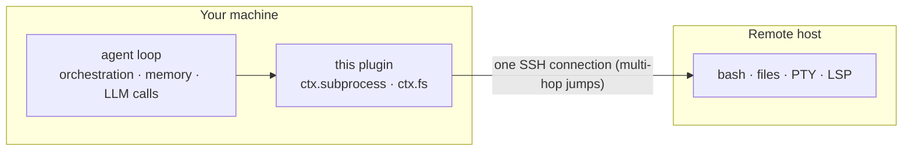

# dsh-workspace-enhancement

English | [中文](README.zh.md)

   

DeepSeek Harness plugin: local and remote (SSH) workspaces in one place. Remote execution uses a single SSH connection (multi-hop jumps allowed); bash, files, PTY, and LSP share that link. Multi-machine registry with TOFU host keys and OS keychain. Web UI for adding workspaces and editing machines. Also ships 3 `sw_*` model tools. Built on [ssh2](https://github.com/mscdex/ssh2).

## Features

| Feature | Description |
|---|---|
| Remote workspaces | `ctx.subprocess` + `ctx.fs` remote providers: one SSH chain (multi-hop) runs bash / files / PTY / LSP. Tools on those seams switch to remote with no code changes |
| Multi-machine registry | `remote-workspaces/machines.json` + `ssh://<id>/<path>` routing; recognizes `~/.ssh/config` aliases |
| Security | TOFU host keys (`accept-new` / `verify` / `off`); per-machine OS keychain (DPAPI / security / secret-tool); credentials redacted in error messages |
| Web UI | Add workspace (connection sidebar + remote directory browser); machine settings (CRUD / test / set current / forget fingerprint) |
| Model tools | `sw_status`, `sw_connect` (`save:false` for temporary), `sw_pick_workspace` |

## Architecture



No DSH install on the remote: the model orchestrates locally, commands run remotely, results come back into context.

## Install

```sh
dsh plugin --profile web add <this-repo-path>   # from source: npm run build first (host loads lib/)
```

## References

- [dsh-ssh](https://github.com/UynajGI/dsh-ssh): remote execution engine — `ctx.subprocess` / `ctx.fs` providers, jump chains, PTY, directory-picker seam, `session.route` placeholder.
- [dsh-remote](https://github.com/flymysql/dsh-remote): workspace helper — machines registry, TOFU, OS keychain, web UI and settings page.

## License

MIT
