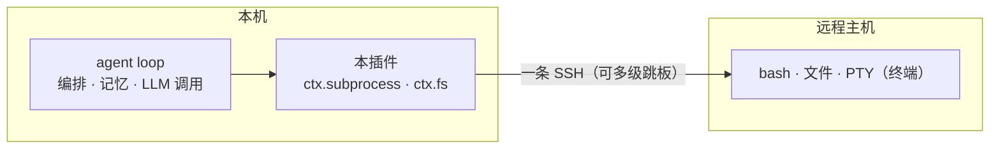

# dsh-workspace-enhancement

[English](README.md) | 中文

   

**一个 DeepSeek Harness 工作区增强插件**：把本地和远程（SSH）工作区放到一个包里统一管理。一个会话可以挂**多个工作区**（主工作区 + 副目录声明清单）；机器、TOFU 指纹与钥匙串都存在你本机的 `~/.dsh` 下。底层用 [ssh2](https://github.com/mscdex/ssh2)。

## 功能

| 功能     | 说明 |
| ------ | ------ |
| 远程工作区 | `ctx.subprocess` + `ctx.fs` 透明远程 provider：一条 SSH（多级跳板）跑 bash / 文件 / PTY / 目录浏览，走这两条缝的工具不用改就切到远程 |
| 多工作区会话 | 会话标题栏「⊕ 工作区」按钮：一个会话可挂一个或多个**副工作区**（本地目录 / 远程机器目录）的**薄声明清单**（挂/卸 + 显示名；权限档位已随 ADR-0019 退役）；模型能看到清单并直接操作 |
| 添加工作区流程 | 连接侧栏（已保存机器、`~/.ssh/config` 别名、本机）+ 目录浏览器（面包屑、系统选择器、新建文件夹）；远程「连接并打开」直接在服务器上建会话 |
| 机器设置页 | 机器增删改 / 测试 / 设当前 / 忘指纹；OS 钥匙串存密码；TOFU 主机指纹（默认 accept-new） |
| 会话感知 | 会话栏远程标识 + 未知/活跃/离线三态 + 重连；每会话自动注入远程/副工作区上下文 |
| 跨服务器执行 | `sw_exec(server, command)` 在**指定服务器**上执行命令（注册表 id（`c1`…）或临时连接 id（`sw_connect save:false`）；缺省=当前会话机器）；目标 OS 每次连接探测一次并上报（POSIX 跑 `bash -c`，win32 跑 `pwsh -Command`）；win32 宿主另注册 `bash` 工具供远程 Linux 工作区使用 |
| 模型工具 | `sw_status`、`sw_connect`（`save:false`=临时）、`sw_pick_workspace`、`sw_exec`（跨服务器执行） |
| 运行时国际化 | 客户端 UI 文案、每会话远程认知提示、`sw_*` 工具描述/错误与协议/数据校验/路由错误全部跟随设置页 **Language** 选项（zh/en）；UI 默认跟随浏览器语言（中文浏览器保持中文）。仅 `bad-request:` 协议层诊断（机器可解析契约）保留英文 |

## 工作原理



远程不用装 DSH：模型在本地编排，命令在远程跑，结果再回本地进上下文。

**设计要点**（实现机制，非用户功能）：

- **注册表与路由**：`remote-workspaces/machines.json` 是单一事实源；`ssh://<id>/<path>`（以及本地 `dsw-routes` 占位树）把每个操作路由到对应机器；能识别 `~/.ssh/config` 别名。
- **安全**：TOFU 主机指纹（`accept-new` / `verify` / `off`）；按机器存 OS 钥匙串（DPAPI / security / secret-tool）；错误消息里脱敏凭据。
- **副工作区 = 薄声明清单**（ADR-0019）：副根只声明「本会话可直接操作该目录」（挂/卸 + 显示名），不再有 fs/exec 权限档位——远程会话内同机任意绝对路径本就可达，逐根限权挡不住 shell。远程副根仍参与路由（绝对路径落在远程副根上时，即使会话 cwd 是本地也走该机器）；真正的隔离手段是每会话 `sandbox/mode`（本地）与操作者信任边界。
- **`sw_exec` 语义**：命令永远在**指定服务器**上执行——`server` 接受注册表 id 或临时连接 id（`sw_connect save:false`），缺省=当前会话机器（本地会话无 server 报错）。目标 OS 每次连接探测一次（`uname -s` → `cmd /c ver` → `unknown`）并在输出首行上报；POSIX/unknown 跑 `bash -c`，win32 跑 `pwsh -Command`。spawn 走同一混合 provider：机器路由原样生效。`run_in_background` 与官方 bash 工具一致（即时返回 job id、无 timeout；依赖 `ctx.jobs`，缺服务明确报错）；不提供 `sandbox_permissions`/escalation（部署策略专属）。
- **win32 `bash` 接缝**：win32 宿主上由本插件补注册 `bash` 工具（官方 bash 执行器未组合、名字可用）——远程 Linux 会话真跑远端 `bash -c`，本地 Windows 会话明确报错而非静默降级；POSIX 宿主不注册（官方 `bash` 工具持有该名字）。

## 安装

```sh
# 从 npm 安装（v0.1.0+）
dsh plugin --profile web add dsh-workspace-enhancement
# 源码安装：先 npm run build（宿主加载 lib/）
dsh plugin --profile web add <本仓库路径>
```

> **DSH 供应链 pnpm 首次安装须知**：原生构建脚本默认被拦截。先在 profile 的
> `pnpm-workspace.yaml`（非严格 `allowBuilds`）放行 `ssh2`、`cpu-features`、`koffi`、
> `node-pty`、`dsh-subprocess-local`，再执行 `dsh plugin --profile web install`；
> 否则首次 `add` 会以非 0 退出（`ERR_PNPM_IGNORED_BUILDS`）且 bundle 不会被追加。

## 版本兼容

装哪个版本的插件，取决于你跑的 **DSH 宿主家族**——用 `dsh --version` 查看（家族版本可看
DSH 安装目录下的 `@deepseek-ai/`，如 `<npm root -g>/@deepseek-ai/`）：

| 你的 DSH 宿主 | 该装哪个版本 | 说明 |
|---|---|---|
| **`0.1.5` 线**（`0.1.5-rc.1`、`0.1.5-rc.2`…） | **0.1.4 或更新** | **唯一**受支持的家族（peer 收窄为 `^0.1.5-rc.1`）。浏览器通道挂官方共享 `/api`（`/api/dsw/<端点>`），不再自挂 `/dsw` |
| `0.1.2-rc.1` 家族（`0.1.2`、`0.1.3` 发布物） | `0.1.3`——该线的最后一个版本 | **已停止支持**（2026-09-11 退场）。该线挪动了 Connection 接缝（`connection.rpc.handle` 已无法注册通道），不会再回填修复 |
| 其它 / 更老的线 | — | 从未支持 |

**宿主与插件必须同步升级。** 0.1.4 线说 `/api/dsw/*`，0.1.3 及更早说 `/dsw/*`，且 0.1.3 没有
`readByteRange`：混用会让宿主起得来、但连接/目录 UI **静默拿不到数据**（机器列表读不出、目录浏览报错）。
支持窗口与上游漂移记录见 [docs/compatibility.md](./docs/compatibility.md)。

## 路线图

当前进度与剩余里程碑：见 [docs/ROADMAP.md](./docs/ROADMAP.md)。唯一待办真相源是
[docs/backlog.md](./docs/backlog.md)，生成的状态快照是 [docs/status.md](./docs/status.md)。

## 开发

先读 [AGENTS.md](./AGENTS.md)（规则、命令、红线）。然后：

| 文档 | 回答什么 |
|---|---|
| [docs/backlog.md](./docs/backlog.md) | 什么在计划中、进行中、被挡住、已完成 |
| [docs/status.md](./docs/status.md) | 版本、HEAD、待办分布（`npm run status` 生成） |
| [docs/architecture.md](./docs/architecture.md) | 插件怎么搭、怎么接线 |
| [docs/decisions/](./docs/decisions/) | 为什么这么做（ADR） |
| [docs/testing.md](./docs/testing.md) | 测试分层、怎么跑、沙箱限制 |
| [docs/compatibility.md](./docs/compatibility.md) | 宿主支持窗口与上游漂移追踪 |
| [docs/rounds/](./docs/rounds/) | 每轮交付了什么、怎么验证的 |

统一质量门：`npm run check`（静态闸门 + typecheck + 单测 + build + pack 冒烟）——CI 跑的就是这一条。

## 参考项目

- [dsh-ssh](https://github.com/UynajGI/dsh-ssh)：远程执行引擎（`ctx.subprocess` / `ctx.fs` provider、跳板链、PTY、directory-picker 接缝、`session.route` 占位）。
- [dsh-remote](https://github.com/flymysql/dsh-remote)：工作区助手（machines 注册表、TOFU、OS 钥匙串、Web UI 与设置页）。

## License

MIT
