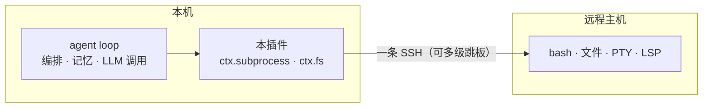

# dsh-workspace-enhancement

[English](README.md) | 中文

   

DeepSeek Harness 插件：本地和远程（SSH）工作区放在一起管。远程执行走一条 SSH（可多级跳板），bash、文件、PTY、LSP 共用这条连接；多机注册表带 TOFU 指纹和 OS 钥匙串；Web UI 负责加工作区和改机器设置；另外提供 3 个 `sw_*` 模型工具。底层用 [ssh2](https://github.com/mscdex/ssh2)。

## 功能列表


| 功能     | 说明                                                                                               |
| ------ | ------------------------------------------------------------------------------------------------ |
| 远程工作区  | `ctx.subprocess` + `ctx.fs` 远程 provider：一条 SSH（多级跳板）跑 bash / 文件 / PTY / LSP。走这两条缝的工具不用改就能切到远程    |
| 多机注册表  | `remote-workspaces/machines.json` + `ssh://<id>/<path>` 路由；能认 `~/.ssh/config` 别名                 |
| 安全     | TOFU 主机指纹（`accept-new` / `verify` / `off`）；按机器存 OS 钥匙串（DPAPI / security / secret-tool）；错误消息里脱敏凭据 |
| Web UI | 添加工作区（连接侧栏 + 远程目录浏览）；机器设置页（增删改 / 测试 / 设当前 / 忘指纹）                                                 |
| 模型工具   | `sw_status`、`sw_connect`（`save:false` 临时）、`sw_pick_workspace`                                    |


## 架构




远程不用装 DSH：模型在本地编排，命令在远程跑，结果再回本地进上下文。

## 安装

```sh
# 从 npm 安装（v0.1.0+）
dsh plugin --profile web add dsh-workspace-enhancement
# 源码安装：先 npm run build（宿主加载 lib/）
dsh plugin --profile web add <本仓库路径>
```

> **DSH 供应链 pnpm 首次安装须知**：原生构建脚本默认被拦截——在 profile 的
> `pnpm-workspace.yaml`（非严格 `allowBuilds`）先放行 `ssh2`、`cpu-features`、`koffi`、
> `node-pty`、`dsh-subprocess-local`，再执行 `dsh plugin --profile web install`；
> 否则首次 `add` 会以非 0 退出（`ERR_PNPM_IGNORED_BUILDS`）且 bundle 不会被追加。


## 路线图

当前进度与剩余里程碑：见 [docs/ROADMAP.md](./docs/ROADMAP.md)。

## 参考项目

- [dsh-ssh](https://github.com/UynajGI/dsh-ssh)：远程执行引擎——`ctx.subprocess` / `ctx.fs` provider、跳板链、PTY、directory-picker 接缝、`session.route` 占位。
- [dsh-remote](https://github.com/flymysql/dsh-remote)：工作区助手——machines 注册表、TOFU、OS 钥匙串、Web UI 与设置页。


## License

MIT