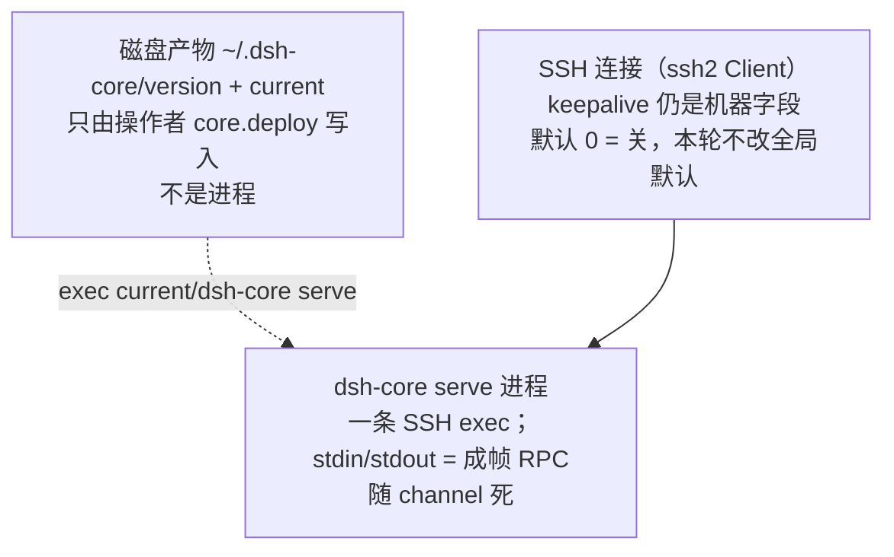

# ADR-0024: 远端核心线协议、自 jail 拓扑与演进舱口

- 状态: accepted
- 日期: 2026-09-13
- 范围: `src/core-*.ts`、`core/`（Go）、围栏档的远程 `ctx.fs` / spawn / browse 切流、
  部署通道 `core.deploy` / `core.status`
- 关联: 产品方向只认 **ADR-0023** / **REQ-I5**；围栏语义与审批门顺序仍认 **ADR-0022** /
  **ADR-0020**（本 ADR 不改「谁做 syscall」）

## 0. 结论

v1 核心是 Linux x86_64 上一个可校验 tarball（`dsh-core` + 捆绑 `bwrap`/`rg`）。
宿主经 SSH exec 拉起 `dsh-core serve`，进程**自己**按 `remoteSandbox` profile
re-exec 进捆绑 bwrap；之后 stdin/stdout 上的成帧 JSON RPC 就是该 jail 里的
syscall / 子进程。围栏档的远程 `ctx.fs` 与 browse mkdir **不再走 SFTP**。
`remoteSandbox: off` 保持今天的 SFTP + 裸 spawn。

## 1. 拓扑

1. 插件按 **`(machineId, mode, workspaceRoot?)`** 缓存活着的 `dsh-core serve`
   （不是「一机一条」）。档位不是 `off` 时，`ssh exec`
   `~/.dsh-core/current/dsh-core serve --sandbox <mode> [--workspace <root>]`。
   进程身份与磁盘产物、SSH 连接的分层见 §6。
2. 核心若尚未 jail（环境变量 `DSH_CORE_JAILED` 未置），用捆绑 `bin/bwrap` 加上
   `core/profile.json` 的向量 re-exec **自身**，stdin/stdout 继承。`--unshare-pid`
   让宿主 `ps` 上每条 serve 显示 **3 个 PID**（外层 bwrap / PID-ns 内层 bwrap /
   `dsh-core serve`）；这是 bubblewrap 的固定树，不是每次 RPC 新起三份。见
   [`../host-silent-fs.md`](../host-silent-fs.md)。
3. 之后 `spawn` 不再包 bwrap：子进程在同一 mount namespace。捆绑 `rg` 靠
   `PATH` 前置 `.../bin`。
4. 核心挂了且档位不是 `off`：fs（含 browse）与 spawn **一起**
   `SANDBOX_UNAVAILABLE`，禁止读面退回 SFTP。
5. 审批门仍看**未包装** argv（ADR-0022 §2.2）。插件侧围栏从「包装 argv」变成
   「确保核心会话活着」，返回原 argv。
6. 交互终端在围栏档仍拒绝（ADR-0022 §2.4）。
7. `remoteSandboxRunner` 不再被读取；runner 永远是捆绑 `bwrap`。

## 2. 线协议

帧：`u32be` 长度 + UTF-8 JSON，单帧上限 16 MiB；写侧串行化，保证帧原子。

- 请求 `{ proto, id, m, p }`；应答 `{ proto, id, ok }` 或
  `{ proto, id, err: { code, message } }`；事件 `{ proto, id: 0, m, p }`。
- `proto` 整数，v1 = `1`。bump 只在帧布局或必选字段不兼容时。
- `hello` 返回 `proto`、`version`、`arch`、`caps`（v1：`fs` / `spawn` / `rg`）、
  当前 sandbox。
- `fs` cap：`fs.realpath` `fs.stat` `fs.lstat` `fs.read` `fs.readRange`
  `fs.listDir` `fs.write` `fs.mkdir`。
- `spawn` cap：`spawn.start` `spawn.stdin` `spawn.terminate` + 事件
  `spawn.stdout` `spawn.stderr` `spawn.exit`。
- **未知 `m` → `err.code=UNIMPLEMENTED`**。JSON 多出来的字段忽略。
- 插件只调用 `hello.caps` 里出现的能力；新插件碰老核心按 cap 降级或
  `SANDBOX_UNAVAILABLE`，不静默走 SFTP。
- `editText` 留在宿主：read + patch + `fs.write`。`processPathFromHostPath`
  远程仍返回 `undefined`。

## 3. 产物与部署

- 工件：`dsh-core-<version>-linux-x64.tar.gz`（`dsh-core`、`bin/bwrap`、`bin/rg`、
  `MANIFEST.json`）。不入库；`.gitignore` 覆盖 `core/dist/`。
- 远端：`~/.dsh-core/<version>/` + `current` 符号链接。不需要 root。
- 首次上传允许 SFTP。设置页按钮 + `core.deploy` / `core.status`，**不**在模型
  第一次调用时偷偷装。
- v1 只认 `linux` + `x86_64`/`amd64`（`uname`）。aarch64 是第二架构，本轮不做。
- Windows 远端与 `off`：今天的 SFTP + 审批门；健康面写「无围栏核心」。

## 4. 演进舱口（v1 预留，不预实现）

1. 加方法只追加 `caps`（`pty`、`landlock`、`fs.edit`、`grep.native`…）。
2. 围栏后端可换（bwrap → landlock）；RPC 不变。
3. 新档位 = 新 `remoteSandbox` 字符串 + 新 profile，不是新核心种类。
4. 传输可换成 jail 内 Unix socket；方法集不动。
5. 不是舱口：围栏档写面回到 SFTP、FUSE、改 sshd、把宿主 DSH 搬到远端。

## 5. 验收

以 ADR-0023 §4 为准，且 UAT 必须**反转** I9-9：围栏打开时官方 `write`/`edit`
在工作区外失败，目标文件不存在。合验脚本：`docs/uat/R27-req-i13-remote-session-sandbox.md`
（覆盖 REQ-I5 + REQ-I13）。「围栏打开」= 会话 confined（非 `danger-full-access`），
不是机器 `remoteSandbox`（ADR-0025）。

## 6. 三层身份、进程寿命、工作区键（2026-09-14 补拍）

三层不要混：

### 6.1 进程寿命

| 问题 | 决定 |
|---|---|
| 何时启动 | 惰性：围栏档第一次 fs / spawn / browse 才 `exec`。`off` 永不拉起。 |
| 活着的判据 | exec stdout 仍开。channel `end`/`error` → 从 hub 丢掉；下次 `require` 再拉。失败仍 fail-closed，不退 SFTP。 |
| 崩溃 / 重连 | `conn.reconnect`、删机器、SSH dispose **关掉该机全部 serve**。只重 exec `current`，**不**自动再上传。 |
| 空闲 | 最后一次 RPC 之后 **10 分钟**（`CORE_IDLE_MS`，常量，暂不上设置页）且没有未结束的 spawn job，杀掉该 serve。根身份记得住，下次 `require` 再拉同一 `--workspace`。不做 systemd user service。 |
| `core.status` | 有活会话时发 **不走缓存** 的 `hello`（证明进程在）。只有缓存 hello 不能当活着。无活会话则 `dsh-core version`（只证明产物在）。 |
| SSH keepalive | **不**改 `keepaliveInterval` 默认 0。TCP keepalive 是机器配置；核心活着靠 channel + 空闲重启。不为核心单独再做 RPC ping 循环。 |
| 自动安装 | **禁止**。Cursor 的 `cursor-server` 随连接静默安装；本插件只认设置页「部署核心」。 |

### 6.2 工作区键

- `read-only`：每机 **一条** serve（`--ro-bind / /`），没有 `--workspace`。
- `workspace-write`：每 **工作区根** 一条（`--bind A A` vs `--bind B B`）。同机路径 A 与路径 B = 两个进程。
- 嵌套：B 在 A 之下 → **共用 A**（可写集是 A 及其后代）。不按文件路径新开 jail。
- **jail 根不是操作路径。** spawn / `fs.resolve({ cwd })` 的会话 cwd 可以登记一个兄弟根。browse / picker 的「当前列出目录」只当 `path` 去匹配已有根，**不得**变成 `--workspace`。
- 写 `ssh://c1/…` 时：在「机器 `workspace`/`cwd` + 本连接已登记的根 + 该机副根」里取 **最长包含前缀**。没有任何包含前缀 → 退回机器登记工作区（写到兄弟目录会被 jail 拒绝，直到该目录作为会话 cwd spawn 过，或登记为机器工作区/副根）。
- 磁盘产物 `~/.dsh-core/current` 仍是全机一份；多个 serve 都 exec 同一二进制。

### 6.3 宿主静默探测不是会话 cwd（`BUG-4`）

上游会在**对话轨迹之外**对 `ctx.fs` 做项目根探测（沿目录找 `.git`，给 `AGENTS.md` / skills 定根）。调用几乎只有 `resolve(path)`，不带会话 cwd。这仍是操作路径，适用 §6.2「不得变成 `--workspace`」——与 browse 列出目录同一条规则。

现状缺口：混合门面把这次路径（或 `dirname`）填进 hub 的 `cwd`，`resolveCoreWorkspace` 就会为每个祖先铸一条 workspace-write serve。事实、谁在走、R27 现场进程见 [`../host-silent-fs.md`](../host-silent-fs.md)。修法跟踪 **`BUG-4`**。
