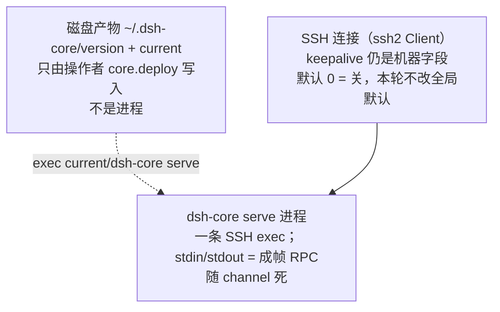

# ADR-0024: 远端核心线协议、自 jail 拓扑与演进舱口

- 状态: accepted
- 日期: 2026-09-13
- 范围: `src/core-*.ts`、`core/`（Go）、围栏档的远程 `ctx.fs` / spawn / browse 切流、
  部署通道 `core.deploy` / `core.status`
- 关联: 产品方向只认 **ADR-0023** / **REQ-I5**；围栏语义与审批门顺序仍认 **ADR-0022** /
  **ADR-0020**（本 ADR 不改「谁做 syscall」）

## 0. 结论

v1 核心是 Linux x86_64 上一个可校验 tarball，**只含第一方 `dsh-core`**；第三方工具按
§3 的来源策略在部署时落地（`bwrap` 由远端发行版提供，`rg` 缺失时才从官方 release 取）。
宿主经 SSH exec 拉起 `dsh-core serve`，进程**自己**按 `remoteSandbox` profile
re-exec 进解析到的 bwrap；之后 stdin/stdout 上的成帧 JSON RPC 就是该 jail 里的
syscall / 子进程。围栏档的远程 `ctx.fs` 与 browse mkdir **不再走 SFTP**。
`remoteSandbox: off` 保持今天的 SFTP + 裸 spawn。

## 1. 拓扑

1. 插件按 **`(machineId, mode, workspaceRoot?)`** 缓存活着的 `dsh-core serve`
   （不是「一机一条」）。档位不是 `off` 时，`ssh exec`
   `~/.dsh-core/current/dsh-core serve --sandbox <mode> [--workspace <root>]`。
   进程身份与磁盘产物、SSH 连接的分层见 §6。
2. 核心若尚未 jail（环境变量 `DSH_CORE_JAILED` 未置），用**解析到的** bwrap 加上
   `core/profile.json` 的向量 re-exec **自身**，stdin/stdout 继承。解析顺序：
   `DSH_CORE_BWRAP` → 与核心同目录的 `bin/bwrap`（若运维手动放了一份）→ 远端
   `PATH` 上的 `bwrap`（见 §3）。`--unshare-pid`
   让宿主 `ps` 上每条 serve 显示 **3 个 PID**（外层 bwrap / PID-ns 内层 bwrap /
   `dsh-core serve`）；这是 bubblewrap 的固定树，不是每次 RPC 新起三份。见
   [`../notes/host-silent-fs.md`](../notes/host-silent-fs.md)。
3. 之后 `spawn` 不再包 bwrap：子进程在同一 mount namespace。`bin/rg`（只在远端本来
   没有 `rg`、且宿主成功取回官方件时才存在）靠 `PATH` 前置 `.../bin`，否则回退到
   远端自己的 `rg`。
4. 核心挂了且档位不是 `off`：spawn 与 **写面** `SANDBOX_UNAVAILABLE`。
   **读面**降到 SFTP（REQ-I15 / ADR-0025 §2.1，2026-09-19 修订；本条原「禁止读面退回
   SFTP」已由那次修订取代）。
5. 审批门仍看**未包装** argv（ADR-0022 §2.2）。插件侧围栏从「包装 argv」变成
   「确保核心会话活着」，返回原 argv。
6. 交互终端在围栏档仍拒绝（ADR-0022 §2.4）。
7. `remoteSandboxRunner` 不再被读取；runner 由核心自己解析（见 §1.2 / §3）。

## 2. 线协议

帧：`u32be` 长度 + UTF-8 JSON，单帧上限 16 MiB；写侧串行化，保证帧原子。

- 请求 `{ proto, id, m, p }`；应答 `{ proto, id, ok }` 或
  `{ proto, id, err: { code, message } }`；事件 `{ proto, id: 0, m, p }`。
- `proto` 整数，v1 = `1`。bump 只在帧布局或必选字段不兼容时。
- `hello` 返回 `proto`、`version`、`arch`、`caps`（v1：`fs` / `spawn` / `rg`）、
  当前 sandbox。
- `fs` cap：`fs.realpath` `fs.stat` `fs.lstat` `fs.read` `fs.readRange`
  `fs.listDir` `fs.write` `fs.mkdir`。
- `spawn` cap：`spawn.start` `spawn.stdin` `spawn.terminate` + 事件
  `spawn.stdout` `spawn.stderr` `spawn.exit`。
- **未知 `m` → `err.code=UNIMPLEMENTED`**。JSON 多出来的字段忽略。
- 插件只调用 `hello.caps` 里出现的能力；新插件碰老核心按 cap 降级或
  `SANDBOX_UNAVAILABLE`，不静默走 SFTP。
- `editText` 留在宿主：read + patch + `fs.write`。`processPathFromHostPath`
  远程仍返回 `undefined`。

## 3. 产物与部署

> **2026-09-16 政策修订（INFRA-15 收口，所有者拍板）**：本仓库**不再分发任何第三方
> 二进制**——既不随 npm 包，也不进 git 历史。（原方案把 linux-x64 `bwrap`+`rg` 入库并
> 打进 tarball，被否：来源说不清、许可要跟着走、二进制进 git 不可回收。）

- 工件：`dsh-core-<version>-linux-x64.tar.gz`（**只含** `dsh-core` + `MANIFEST.json`）。
  不入库；`.gitignore` 覆盖 `core/dist/` 与 `core/vendor/`。
- **版本/架构单一来源**：`core/artifact.json`（第一方）与 `core/vendor.json`（第三方
  pin），由 `scripts/sync-core-manifest.mjs` 生成 `src/core-artifact.ts` 与
  `src/core-vendor-pins.ts`；`npm run check:static` 第 14 道闸门拦漂移。
- **`bwrap`：远端自带，永不由我们提供**（上游只发源码 tarball，没有官方二进制；
  `containers/bubblewrap` 的 release 资产只有 `.tar.xz` + `.sha256sum`）。核心按
  §1.2 的顺序解析；**找不到就拒绝**这次围栏操作（`SANDBOX_UNAVAILABLE`），
  文案给出各发行版安装命令与「临时改用 `danger-full-access`」两条出路——
  宿主进程**不崩**、其他工具照常。宿主侧探测发生在部署时（状态备注）与围栏探针时。
- **`rg`：远端优先，缺失才由宿主取官方件**。部署前探 `command -v rg`：有 ⇒ 什么都不推；
  没有 ⇒ 宿主从 **ripgrep 官方 release**（`BurntSushi/ripgrep`，`x86_64-unknown-linux-musl`
  静态件）下载 → 校验 `core/vendor.json` 里 pin 的 sha256（与官方 `.sha256` 资产交叉核对）
  → 解出 `rg` → 缓存到 `$DSH_HOME/cache/dsw-core-vendor/rg-<version>-<arch>/rg`
  （附 `.sha256` sidecar）→ 与核心一起 SFTP 推送到 `~/.dsh-core/<version>/bin/rg`。
  网络：`curl`，尊重 `https_proxy`/`http_proxy`；`DSW_CORE_VENDOR_PROXY` 覆盖代理，
  `DSW_CORE_VENDOR_BASE_URL` 换镜像前缀，`DSW_CORE_VENDOR_OFFLINE=1` 禁网。
  **开发开关** `DSW_CORE_VENDOR_FORCE_MISSING=rg,bwrap`：让部署把列出的工具当作远端
  **没有**（否则 fetch+推送那半只能在真缺该工具的机器上跑到）；部署 detail 会自报该
  开关生效，以免被误读成真实探测结果。
  **取不回来不算部署失败**：核心照装，状态备注给出官方地址 + 期望 sha256 + 缓存路径，
  运维可手放文件或直接在远端装 ripgrep，再部署一次即可。
- **npm 分发含工件**（INFRA-15）：`package.json` `files` 含 `core/dist/`，
  `prepack` 守卫（`scripts/ensure-core.mjs`）保证打包前工件必在，
  `npm run check` 在 pack 冒烟前构建 tarball——通过 npm 安装的实例开箱即可
  `core.deploy`，且包里**没有**第三方二进制。
- 远端：`~/.dsh-core/<version>/` + `current` 符号链接。不需要 root。
- 首次上传允许 SFTP。设置页按钮 + `core.deploy` / `core.status`。
  **（2026-09-29 修订，`REQ-I14`）**：上面「不在模型第一次调用时偷偷装」的原表述由
  下面的部署无感化条目取代——装仍不发生在模型工具路径里，但也不再要求用户手工。
- **部署无感化（2026-09-29，`REQ-I14`；2026-09-30 修订，`REQ-I21`）**：围栏≠off 的机器被连进会话
  （`sw_connect` / 面板开关 / `session.conn.*`）后，后台跑一次 `core.status`：
  缺核心或版本≠`CORE_ARTIFACT_VERSION` 就 `core.deploy`（fire-and-forget，连接时延
  不为上传买单；失败只留下现状）。**首用审批**：围栏打开撞上磁盘工件确证缺失/过期
  时，经平台 approval 问一次（`[dsw-core-deploy]` 标记，**不是** AI 应答器的
  gate 标记——给远端装二进制永远是人拍板），`allowed-once` 才部署并重试一次；
  其余结局落回原 fail-closed 拒绝（文案即 REQ-I17 的部署提示）。
  **探测翻链**：升级时先解压到 `~/.dsh-core/<version>/`，版本化路径探针
  （`dsh-core version` 退出 0）通过才 `ln -sfn current`——坏工件永远搁浅不了机器。
  本条修订 §6.1 的「自动安装禁止」行；第三方来源策略（bwrap 永不由我们提供、
  rg 官方件）等其余红线不变。
  **REQ-I21 修订（2026-09-30 用户 lab 实测）**：首用审批的运行时前提链
  （approval 服务 + 人应答器 + initiator ALS + open turn）任何一环断掉都会**静默**
  落回 fail-closed——实测就是这样（转录无 approval 审计对 ⇒ `request()` 未达，
  且当时 asker 零日志不可定位）。因此模型工具渠道不再只赌审批：
  **`sw_connect` 对每台可达机器同步 `core.status`→`core.deploy` 并把结果
  写进工具输出**（部署失败是报告行，绝不是 connect 失败；首用审批 ask 保留为
  能弹则弹的零触摸补充，其全部 false 路径补 warn 日志）；**`sw_status` 对每台
  已连接的机器报告核心版本/缺口**；REQ-I17 的 fail-closed 文案改为先指
  `sw_connect`（模型可执行），设置页/core.deploy 仍作为操作员出路。
  **同轮门控修正**：核心供给（预热/同步/状态行）一律**不再看机器的
  `remoteSandbox` 字段**——实测用户会话以 workspace-write 围栏时机器字段是
  `off`，按字段门控把部署全挡了。围栏跟着**会话**走（`resolveRemoteSessionMode`
  fail-safe `read-only`，ADR-0025），任何已连接机器都可能围栏 ⇒ 都供给；
  机器字段继续只管终端守卫、旧路径 fence 与状态显示。
  **溯源门（2026-09-30 用户拍板，sha256 白名单）**：版本串是核心**自报**的，
  hash 不是——打开 serve 后插件经控制通道 `sha256sum` 磁盘二进制，不在
  `core/artifact.json` 的 `compatHashes` 白名单内即拒（围栏档 `SANDBOX_UNAVAILABLE`、
  danger 落 SFTP，都不运行来历不明二进制）；活会话复用不重查（进程在它自己的
  open 时已验，事后换文件改不了运行中的 inode）。部署侧收口：装后校验
  安装哈希 = MANIFEST 声明值；静态闸门 + pack-smoke 双断言 **dist 里的二进制
  必须已登记**——核心升级忘了登 hash 必红，发不出去。诚实边界：插件侧
  `sha256sum` 依赖远端 coreutils 诚实，防的是误换/损坏/伪造版本串，不是
  全面攻陷的远端。
  **同日用户终拍板（部署必问）**：部署是审批动作，三条规则——①凡**尝试部署**
  必先经平台 approval 问（`sw_connect` 同步梯子与首用 gap 都接同一 ask；
  拒绝=报告行+保持现状，再跑会再问）；②**danger-full-access 会话不尝试部署**
  （核心非必需）；③**磁盘已是当前版本不问也不装**。后台预热（面板/通道路径）
  在模型 turn 之外**问不了** ⇒ 降级为纯探测+告警（日志点名缺口），部署只发生在
  能问的路径上。自动安装与「无感化」表述就此作废——本条为准。
- **核心版本门（2026-09-21，`REQ-I17`；宽度放宽 2026-09-30 用户拍板）**：围栏档
  只认本插件随包 `CORE_ARTIFACT_VERSION` 的 **major.minor 线**——patch 漂移
  （新旧皆可）按依赖语义直接可用，不问不部署；跨 minor/major 才
  spawn 与写面 `SANDBOX_UNAVAILABLE`，文案提示设置页部署最新核心；
  （原「逐字精确匹配」表述由本条取代；如某 patch 修复必须强制，
  预留 `core/artifact.json` 加 `min` 字段收紧的口子，本轮不做）
  **禁止默默跑旧核心**（组杀、`version` 算法都在核心里，旧二进制等于没修）。
  读面仍走 REQ-I15（SFTP）。`danger` / `off` 不挡（经 `CoreMissingError` 落回
  SFTP，而非跑旧核）。无感升级是 `REQ-I14`——本条是升级完成前的 fail-closed。
  活会话复用时也查缓存的 `hello.version`（不发电）：`current` 被翻链后，
  存活旧 serve 会被丢弃重 exec。
- v1 只认 `linux` + `x86_64`/`amd64`（`uname`）。aarch64 是第二架构，本轮不做。
- Windows 远端与 `off`：今天的 SFTP + 审批门；健康面写「无围栏核心」。

## 4. 演进舱口（v1 预留，不预实现）

1. 加方法只追加 `caps`（`pty`、`landlock`、`fs.edit`、`grep.native`…）。
2. 围栏后端可换（bwrap → landlock）；RPC 不变。
3. 新档位 = 新 `remoteSandbox` 字符串 + 新 profile，不是新核心种类。
4. 传输可换成 jail 内 Unix socket；方法集不动。
5. 不是舱口：围栏档写面回到 SFTP、FUSE、改 sshd、把宿主 DSH 搬到远端。

## 5. 验收

以 ADR-0023 §4 为准，且 UAT 必须**反转** I9-9：围栏打开时官方 `write`/`edit`
在工作区外失败，目标文件不存在。合验脚本：`docs/uat/R27-req-i13-remote-session-sandbox.md`
（覆盖 REQ-I5 + REQ-I13）。「围栏打开」= 会话 confined（非 `danger-full-access`），
不是机器 `remoteSandbox`（ADR-0025）。

## 6. 三层身份、进程寿命、工作区键（2026-09-14 补拍）

三层不要混：

```mermaid
flowchart TB
  artifact["磁盘产物 ~/.dsh-core/version + current<br/>只由操作者 core.deploy 写入<br/>不是进程"]
  ssh["SSH 连接（ssh2 Client）<br/>keepalive 仍是机器字段<br/>默认 0 = 关，本轮不改全局默认"]
  serve["dsh-core serve 进程<br/>一条 SSH exec；stdin/stdout = 成帧 RPC<br/>随 channel 死"]
  artifact -.->|"exec current/dsh-core serve"| serve
  ssh --> serve
```

### 6.1 进程寿命

| 问题 | 决定 |
|---|---|
| 何时启动 | 惰性：围栏档第一次 fs / spawn / browse 才 `exec`。`off` 永不拉起。 |
| 活着的判据 | exec stdout 仍开。channel `end`/`error` → 从 hub 丢掉；下次 `require` 再拉。失败仍 fail-closed，不退 SFTP。 |
| 崩溃 / 重连 | `conn.reconnect`、删机器、SSH dispose **关掉该机全部 serve**。只重 exec `current`，**不**自动再上传。 |
| 空闲 | 最后一次 RPC 之后 **10 分钟**（`CORE_IDLE_MS`，常量，暂不上设置页）且没有未结束的 spawn job，杀掉该 serve。根身份记得住，下次 `require` 再拉同一 `--workspace`。不做 systemd user service。 |
| `core.status` | 有活会话时发 **不走缓存** 的 `hello`（证明进程在）。只有缓存 hello 不能当活着。无活会话则 `dsh-core version`（只证明产物在）。 |
| SSH keepalive | **不**改 `keepaliveInterval` 默认 0。TCP keepalive 是机器配置；核心活着靠 channel + 空闲重启。不为核心单独再做 RPC ping 循环。 |
| 自动安装 | **2026-09-29 修订（`REQ-I14`，见 §3「部署无感化」）**：围栏≠off 机器连进会话后后台预热部署第一方工件；模型工具路径上的安装仍禁止——那条路走的是首用审批（人拍板）。原表述「禁止。Cursor 的 `cursor-server` 随连接静默安装；本插件只认设置页『部署核心』」由预热+审批取代：区别在于装的是本插件自己的第一方工件、且经用户自己的 SSH 通道，不是从第三方源拉软件。 |

### 6.2 工作区键

- `read-only`：每机 **一条** serve（`--ro-bind / /`），没有 `--workspace`。
- `workspace-write`：每 **工作区根** 一条（`--bind A A` vs `--bind B B`）。同机路径 A 与路径 B = 两个进程。
- 嵌套：B 在 A 之下 → **共用 A**（可写集是 A 及其后代）。不按文件路径新开 jail。
- **jail 根不是操作路径。** spawn / `fs.resolve({ cwd })` 的会话 cwd 可以登记一个兄弟根。browse / picker 的「当前列出目录」只当 `path` 去匹配已有根，**不得**变成 `--workspace`。
- 写 `ssh://c1/…` 时：在「机器 `workspace`/`cwd` + 本连接已登记的根 + 该机副根」里取 **最长包含前缀**。没有任何包含前缀 → 退回机器登记工作区（写到兄弟目录会被 jail 拒绝，直到该目录作为会话 cwd spawn 过，或登记为机器工作区/副根）。
- 磁盘产物 `~/.dsh-core/current` 仍是全机一份；多个 serve 都 exec 同一二进制。

### 6.3 宿主静默探测不是会话 cwd（`BUG-4`）

上游会在**对话轨迹之外**对 `ctx.fs` 做项目根探测（沿目录找 `.git`，给 `AGENTS.md` / skills 定根）。调用几乎只有 `resolve(path)`，不带会话 cwd。这仍是操作路径，适用 §6.2「不得变成 `--workspace`」——与 browse 列出目录同一条规则。

探测路径只当 `path`（`BUG-4`，2026-09-17）：`resolve` / `lstat` 不再把被查路径填进 hub 的 `cwd`。事实、谁在走、R27 现场进程见 [`../notes/host-silent-fs.md`](../notes/host-silent-fs.md)。无 `.git` 的远程会话实机尾巴仍待验。
